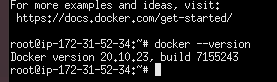
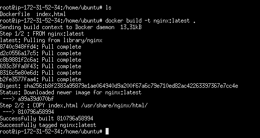
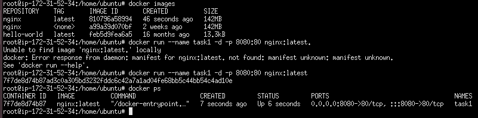
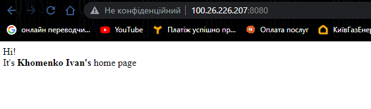
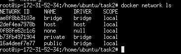

Docker. Task1 
----------------------------------------------
- I installed Docker on AWS instance


- Here is my Dockerfile based on Nginx image: [Dockerfile1](Dockerfile1)
- with command I built my image
```
docker build -t nginx:latest .
```

- with command I ran my just created docker image
```
docker run -name task1 -d -p 8080:80 nginx:latest 
```

- here is the result 


----------------------------------------------

To run a playbook please use:
```
ansible-playbook playbook.yml -t 'role1'
```
then: 
```
ansible-playbook playbook.yml -t 'role2'
```

<br>
To connect to the instance please use this command:
```
ssh -i ~/.ssh/devops.pem" ubuntu@ec2-44-212-10-217.compute-1.amazonaws.com
```

<br>
- Add user <i>user1</i>. There were 3 unsuccessful tryies with simple passwords

- The successful attemp was `user2`. Here is I've used more difficult password with letters, numbers and specific symbols

