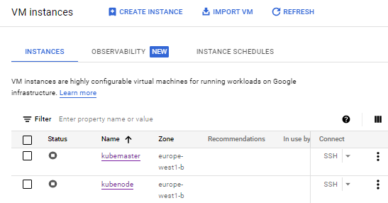
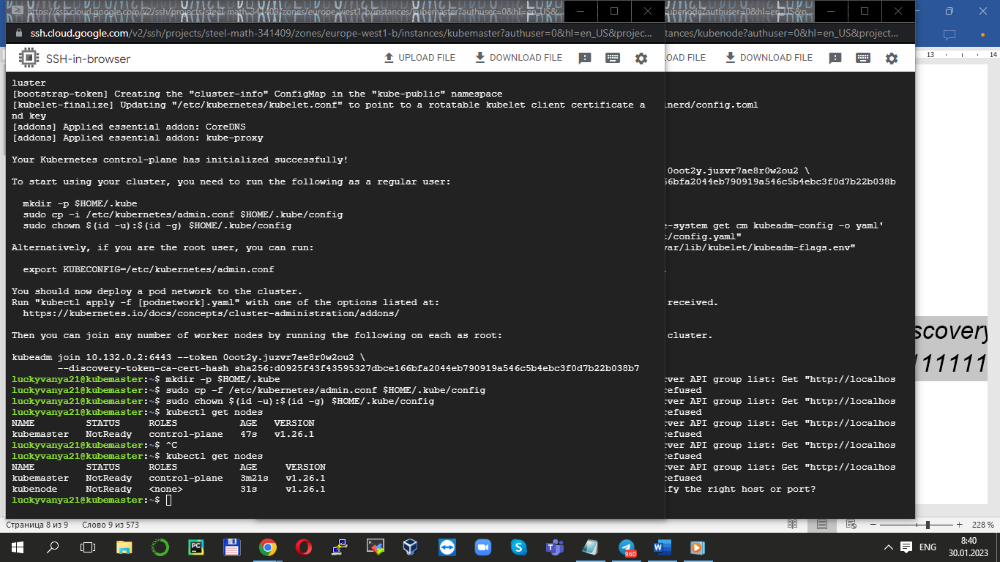
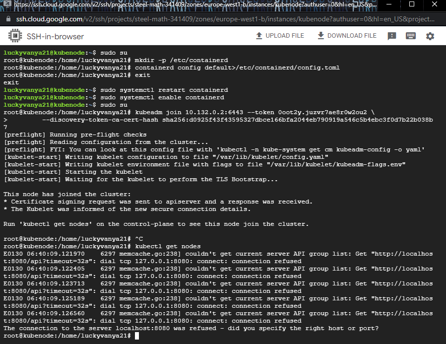
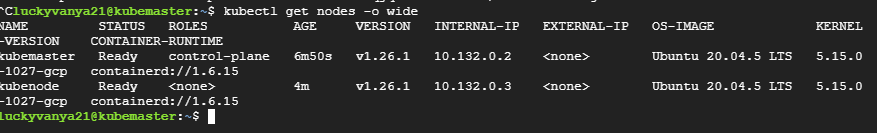

Kubenrnetes. Task11 
----------------------------------------------
- I created 2 Vm's in GCP according to documentation



- After my following instruction I installed kubernetes on 2 Vm's. One is as kubemaster and second as kubenode





- The final result of installation


```
kubectl get nodes -o wide

```



