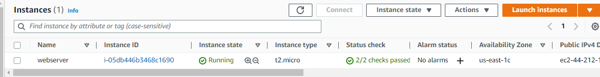
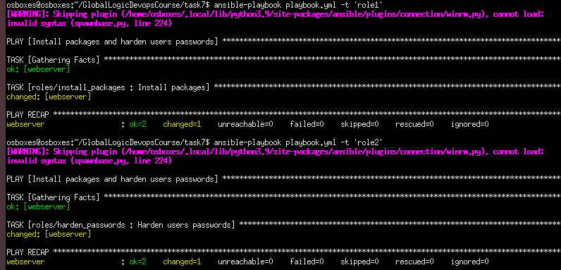
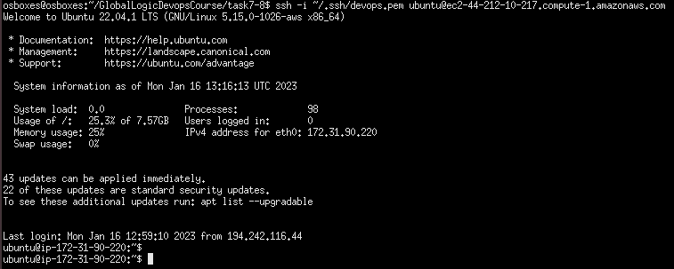
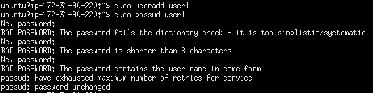
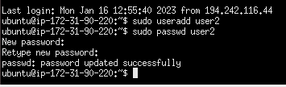

 Task7.

 Execution:
- I created EC2 instance in AWS

Here is my ansible roles structure: </br>
-  [inventory](hosts)
-  [2 roles](roles/install_packages/tasks/main.yml) for installing packages and hardening users password
-  [ansible.cfg](ansible.cfg) file with login info
-  [playbook](playbook.yml) with 2 roles

To run a playbook please use:
```
ansible-playbook playbook.yml -t 'role1'
```

<br>
To connect to the instance please use this command:
```
ssh -i ~/.ssh/devops.pem" ubuntu@ec2-44-212-10-217.compute-1.amazonaws.com
```

<br>
- Add user <i>user1</i>. There were 3 unsuccessful tryies with simple passwords

- The successful attemp was `user2`. Here is I've used more difficult password with letters, numbers and specific symbols

