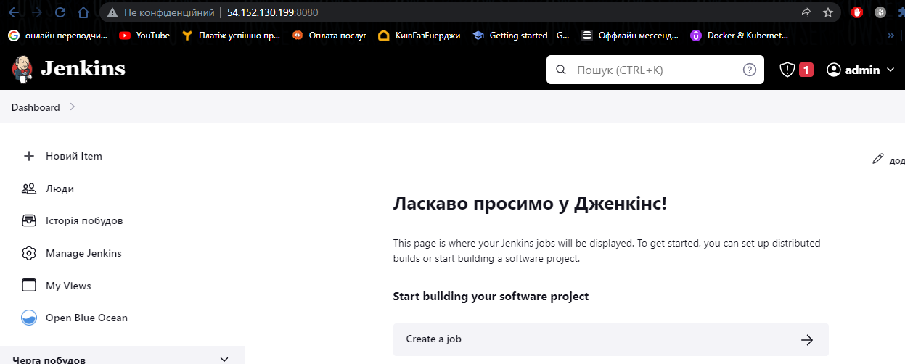
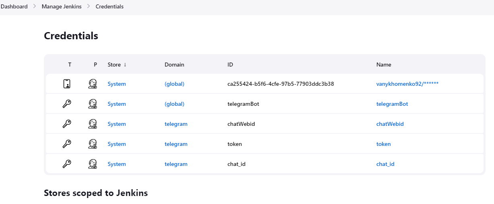
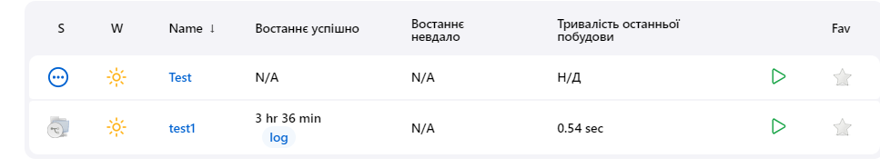
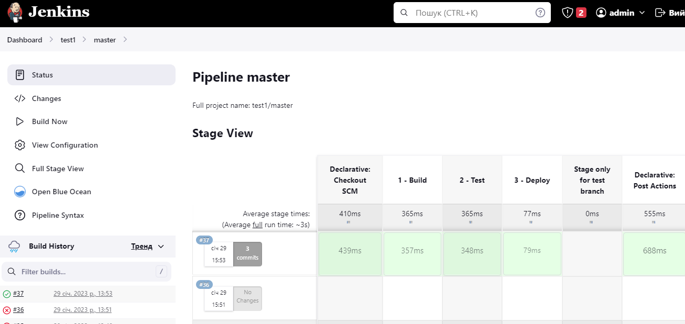
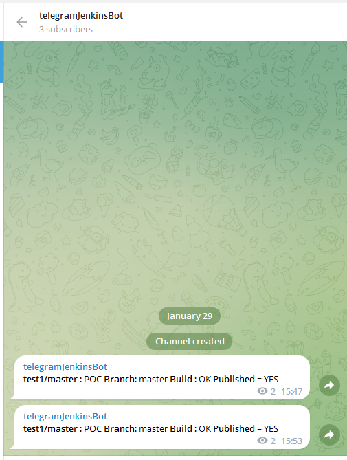

Jenkins
----------------------------------------------
- I installed Jenkins on AWS instance

- I connected my Github repo with fresh installed Jenkins using git plugin and credentials for my own repo : [Jenkinksfile](Jenkinsfile)

- than I created my: [Jenkinsfile] (Jenkinsfile) for Multibranch pipeline

----------------------------------------------
Pipeline main

- And provided telegram notification. Created bot and put credentials (token and chat_id) into global credentials settings 

----------------------------------------------

